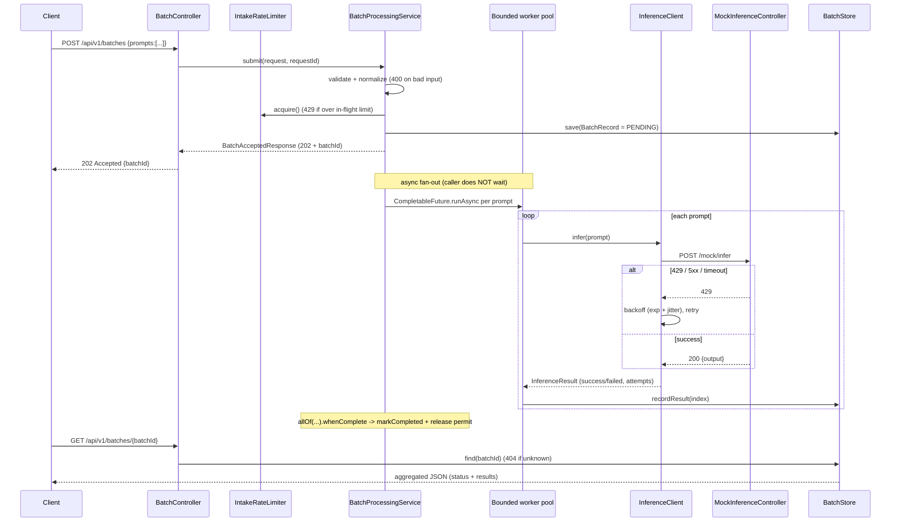
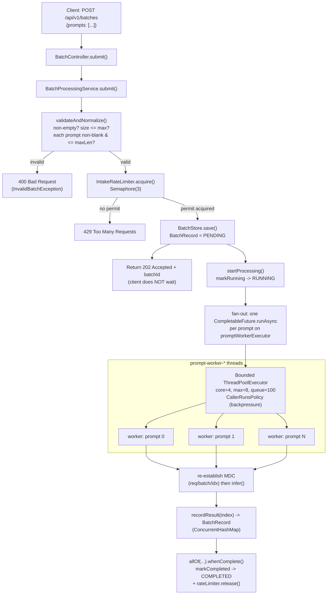
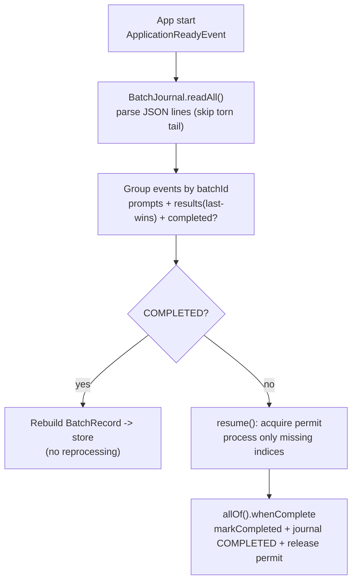

# Architecture — concurrent-prompt-analyzer

This document captures the design of the service: the requirements, the key design decisions (the
ones that were settled in plan mode before any code was written), the component breakdown, the
end-to-end flow, the concurrency/resilience model, and the validation/observability strategy.

---

## 1. Requirements

A scalable, consistent backend service that:

1. Accepts an **array of prompts** via an API upload.
2. Returns an **acknowledgement immediately** and runs the work **asynchronously** in the background.
3. Handles all **basic validations** and **network error handling**.
4. Processes prompts **concurrently** by distributing them across a **bounded pool of workers**
   (using `CompletableFuture` parallelisation) rather than sequentially.
5. **Rate-limits intake** to a small number (3 for the demo); beyond that, returns
   `429 TOO MANY REQUESTS`.
6. Implements **graceful retry** — workers retry with sleep-based backoff to safely back off
   **without dropping prompts** — against a **mock rate-limited inference endpoint** that
   periodically returns `429`.
7. After processing, **aggregates all successful inferences** into a final JSON output once the
   batch completes.
8. Has **JUnit 5 unit testing** and **sensible validations**.
9. Has **logging/telemetry** that registers logs **per hostname** for debugging.
10. Has **durability / crash recovery** — a logfile to recover from if the process fails mid-batch.

---

## 2. Key design decisions

These were the decisions that materially shaped the implementation:

| # | Decision | Choice | Rationale |
|---|----------|--------|-----------|
| 1 | How to implement the "mock rate-limited inference endpoint" | A **real in-app HTTP endpoint** (`POST /mock/infer`) called by workers over the wire via `RestClient` | Demonstrates genuine network calls, timeouts, and `429`s over HTTP — so retry/backoff and network error handling are real, not simulated in-process |
| 2 | How clients retrieve async results | A **polling endpoint** `GET /api/v1/batches/{batchId}` backed by an in-memory store (`PENDING`/`RUNNING`/`COMPLETED` + aggregated results) | Async processing means results aren't available at submit time; polling is the simplest correct retrieval model |
| 3 | Interpretation of "rate limit to 3" | **Two separate limits**: (1) the submission API rejects with `429` when more than the configured number of batches (`analyzer.max-in-flight-batches`) are in-flight; (2) the mock inference endpoint is a genuine rate limiter — a **concurrency cap (semaphore)** returns `429` when more than N calls are in flight, *plus* a deterministic **periodic 429** every Nth call — both triggering worker retry/backoff | Matches the stated requirement: intake is capped, *and* workers must back off against a rate-limited downstream both under concurrent load and on periodic rejections |
| 4 | Concurrency primitive | **`CompletableFuture` fan-out on our own bounded `ThreadPoolExecutor`** — never `ForkJoinPool.commonPool()` | `CompletableFuture` fits independent per-prompt tasks; a bounded pool gives backpressure and is correct for *blocking* HTTP. The common pool is CPU-sized and a poor fit. (Virtual threads were the alternative, but a bounded pool pairs better with a rate-limited dependency.) |
| 5 | Retry policy | **Exponential backoff + jitter**, capped, with a max attempt count; on exhaustion record `FAILED` (never drop) | Safe backoff without thundering-herd; no prompt is silently lost |
| 6 | "Register logs as per hostname" | **Both** interpretations: hostname on **every log line** *and* a **per-host log file** | The phrasing is ambiguous; doing both covers debugging needs |
| 7 | Durability / recovery from failure | An **append-only write-ahead journal** (JSON-lines file) recording `SUBMITTED` / `RESULT` / `COMPLETED` events, replayed on startup to rebuild state and **resume unfinished batches** | The in-memory store loses state on crash; a WAL is the simplest durable log to recover from without standing up a database, and it resumes only the prompts that hadn't finished |

---

## 3. Component breakdown

```
com.example.concurrentpromptanalyzer
├── ConcurrentPromptAnalyzerApplication   # @SpringBootApplication entrypoint
├── config
│   ├── AnalyzerProperties                # @Validated @ConfigurationProperties (fail-fast config)
│   └── ExecutorConfig                    # bounded ThreadPoolExecutor + RestClient (timeouts)
├── controller
│   ├── BatchController                   # POST /api/v1/batches, GET /api/v1/batches/{id}
│   └── MockInferenceController           # POST /mock/infer (semaphore concurrency cap + periodic 429)
├── service
│   ├── BatchProcessingService            # orchestration: validate, admit, fan-out, aggregate
│   ├── InferenceClient                   # HTTP call + retry/backoff policy
│   ├── InferenceResult                   # per-prompt outcome (output, attempts, error)
│   └── Sleeper                           # injectable sleep (fast, deterministic tests)
├── ratelimit
│   └── IntakeRateLimiter                 # Semaphore(3) intake admission
├── store
│   ├── BatchStore                        # ConcurrentHashMap<batchId, BatchRecord>
│   └── BatchRecord                       # thread-safe per-batch state + results
├── journal
│   ├── BatchJournal                      # append-only WAL: durable submit/result/complete events
│   ├── JournalRecoveryService            # replays WAL on startup, resumes unfinished batches
│   ├── JournalEvent                      # one JSON line (SUBMITTED / RESULT / COMPLETED)
│   └── JournalEventType
├── model                                 # request/response records, enums, mock DTOs
├── observability
│   ├── RequestLoggingFilter              # per-request correlation id (X-Request-Id)
│   └── MdcKeys                           # MDC key constants
└── web
    ├── GlobalExceptionHandler            # 400 / 404 / 429 / 500 -> ApiError
    └── ApiError                          # consistent error payload
```

### Layer responsibilities

- **Controller** — HTTP surface only: bind/validate input, delegate, map to status codes.
- **Service** — business orchestration and the concurrency model; owns the batch lifecycle.
- **Ratelimit** — admission control (intake `429`).
- **Store** — thread-safe in-memory persistence of batch state and results.
- **Journal** — durability: write-ahead log of batch events + startup recovery/resume.
- **Observability** — correlation + per-host telemetry.
- **Web** — cross-cutting error translation.

---

## 4. End-to-end flow



### Data flow: API → worker thread pool

A focused view of how a request flows from the API into the bounded worker pool (validation and the
intake `429` both happen *before* any work is scheduled, and the `202` ack returns immediately):



### Batch state machine

```
PENDING ──(workers start)──> RUNNING ──(allOf completes)──> COMPLETED
```

`PromptStatus` per prompt is terminal: `SUCCESS` or `FAILED` (retries exhausted).

---

## 5. Concurrency & resilience model

- **Fan-out:** one `CompletableFuture.runAsync(task, promptWorkerExecutor)` per prompt; joined with
  `CompletableFuture.allOf(...)`.
- **Bounded executor:** `ThreadPoolExecutor` with core/max threads and a `ScalingTaskQueue`. A plain
  bounded queue only grows the pool past `core` once the queue is full, so `max-size` would never be
  reached and parallelism would stall at `core-size`. The scaling queue refuses to enqueue while the
  pool can still grow, **forcing the executor up to `max-size` first**; only then does it buffer, and
  only when the queue is also full does `ForceQueueOrCallerRunsPolicy` run the task on the caller
  thread → **backpressure** without dropping prompts. Threads are named `prompt-worker-*`.
- **Why not the common pool:** `ForkJoinPool.commonPool()` is sized for CPU-bound work; blocking
  HTTP calls would starve it. We always pass our own executor.
- **Intake limiting:** a fair counting `Semaphore` with `analyzer.max-in-flight-batches` permits
  (default 10). A permit is acquired at admission
  and released exactly once when the batch completes (`allOf().whenComplete`). No permit → `429`.
- **Retry/backoff (worker side):** retry on `429` / `5xx` / network errors; **fail fast** on
  non-retryable `4xx` (e.g. `400`). Delay = `min(maxBackoff, initial * multiplier^(attempt-1)) +
  random jitter`, capped, up to `maxAttempts`. On exhaustion the prompt is recorded as `FAILED`,
  **never dropped**. Sleep is behind a `Sleeper` interface so tests stay fast and deterministic.
- **Thread-safety of state:** `BatchStore` is a `ConcurrentHashMap`; `BatchRecord` keeps results in
  a `ConcurrentHashMap<index, PromptResult>` and status/timestamps in atomics — multiple workers
  write concurrently while a client may read the aggregate at any time, with no external locking.

---

## 6. Durability & crash recovery (write-ahead journal)

The batch store is in-memory, so a crash/restart would otherwise lose all in-flight batches. To
recover, the service maintains an **append-only write-ahead journal** — a logfile of events that is
replayed on startup.

- **What is written, and when:**
  - `SUBMITTED` (batchId + normalized prompts) — written **before the `202` ack is returned**, so a
    crash immediately after acknowledgement can still recover the batch.
  - `RESULT` (per-prompt terminal outcome) — written as each prompt finishes.
  - `COMPLETED` — written when the whole batch finishes.
  - Each line is a single JSON object, written and **flushed** immediately (a process crash loses at
    most the one in-flight line).
- **Recovery on startup** (`JournalRecoveryService`, on `ApplicationReadyEvent`):
  1. Read & parse every line (a torn final line from a crash mid-write is tolerated and skipped).
  2. Reconstruct each batch: prompts from `SUBMITTED`, results from `RESULT` (**last-writer-wins per
     index**, so a later successful retry supersedes an earlier failure), completion from `COMPLETED`.
  3. Batches already `COMPLETED` are restored to the store as-is. Batches **not** completed are
     **resumed** — re-processing only the prompts that have no recorded result (finished prompts are
     skipped), reusing the normal worker pool + intake permit + completion path.
- **Safety:** journal writes are **best-effort with respect to the request path** — an I/O error is
  logged but never propagated, so journaling can never take down request processing. Appends are
  guarded by a lock for thread-safety across the many worker threads.



> Trade-off: `flush()` protects against process crashes; surviving an OS/power loss would additionally
> need `fsync` (file-channel `force`). The journal also grows unbounded — production would compact it
> (drop fully-`COMPLETED` batches) or roll it, and a shared/replicated store would replace it for
> horizontal scaling.

---

## 7. Validation strategy (sensible defaults)

| Concern | Where | Result |
|---------|-------|--------|
| `prompts` non-null / non-empty | Bean validation (`@NotNull`, `@NotEmpty`) on `PromptBatchRequest` | `400` |
| Max batch size, max prompt length, blank prompt | Service layer (`BatchProcessingService.validateAndNormalize`) — depends on runtime config | `400` (`InvalidBatchException`) |
| Malformed JSON | `HttpMessageNotReadableException` | `400` |
| Mock endpoint inbound (`prompt` blank) | Bean validation on `InferenceRequest` | `400` |
| Bad pool/retry config at startup | `@Validated @ConfigurationProperties` | App fails fast on boot |
| Unknown `batchId` | Service + `BatchNotFoundException` | `404` |
| Intake limit exceeded | `IntakeRateLimiter` + `TooManyBatchesException` | `429` |

All errors are normalised to a consistent `ApiError` body by `GlobalExceptionHandler`. Prompts are
trimmed; duplicates are intentionally preserved as distinct units of work.

---

## 8. Observability / telemetry

- **Per-line hostname + correlation:** every log line is formatted as
  `[host=<hostname>] ... [req=<requestId> batch=<batchId> idx=<promptIndex> try=<attempt>]`.
- **Per-host log file:** `logs/concurrent-prompt-analyzer-<hostname>.log` (size + time rolling,
  gzip, 14-day history, 500 MB cap). Console stays at `INFO`; the file captures `DEBUG` for this
  package so per-prompt/retry detail doesn't flood the console.
- **Request correlation:** `RequestLoggingFilter` assigns a `requestId` per request (honours an
  inbound `X-Request-Id`, echoes it back) and logs request start/end with status + duration.
- **MDC propagation across the pool:** because `CompletableFuture` tasks run on pool threads and MDC
  is thread-local, the correlation context (`requestId`/`batchId`/`promptIndex`/`attempt`) is
  captured at submit time and re-established inside each worker task, cleared in `finally` to avoid
  leakage across reused threads. This lets you trace a single prompt's full retry story by hostname.

---

## 9. Testing strategy (JUnit 5)

Leverages the bundled `spring-boot-starter-test` (JUnit Jupiter + AssertJ + Mockito + MockMvc); no
extra dependency needed.

| Test | Scope | What it proves |
|------|-------|----------------|
| `IntakeRateLimiterTest` | unit | 3 permits OK, 4th → `429`, release frees a permit |
| `BatchControllerTest` | `@WebMvcTest` + MockMvc | `202` ack, `400` validation cases (empty/missing/malformed), `404` unknown batch |
| `InferenceClientTest` | unit + `MockRestServiceServer` | retry: `429`-then-`200` succeeds (attempts=2), persistent failure exhausts without dropping, non-retryable `400` fails fast; injectable sleeper keeps it fast |
| `BatchProcessingServiceTest` | unit | aggregation correctness, every prompt present exactly once, status → `COMPLETED`, permit released, failures recorded not dropped, validation rejects without leaking a permit |
| `MockInferenceControllerTest` | unit | periodic `429` cadence + success output |
| `ExecutorConfigTest` | unit | pool deterministically bursts beyond `core` up to `max` under load, never drops tasks, uses named worker threads |
| `BatchJournalTest` | unit (`@TempDir`) | append/read roundtrip, disabled-journal no-op, tolerates a torn last line from a crash |
| `JournalRecoveryServiceTest` | unit (`@TempDir`) | resumes an interrupted batch re-processing **only** missing prompts; restores an already-`COMPLETED` batch without reprocessing; permits balanced |
| `ConcurrentPromptAnalyzerApplicationTests` | `@SpringBootTest` | context loads / all beans wire |

---

## 10. Configuration knobs

All in `application.properties` (validated at startup):

- `analyzer.max-batch-size` (100), `analyzer.max-prompt-length` (8000)
- `analyzer.max-in-flight-batches` (10) — the intake `429` threshold
- `analyzer.pool.core-size` / `max-size` / `queue-capacity` (8 / 32 / 500) — scales to max under load
- `analyzer.retry.max-attempts` (5), `initial-backoff-ms` (200), `max-backoff-ms` (2000),
  `multiplier` (2.0), `jitter-ms` (300)
- `analyzer.mock.fail-every-nth` (3), `analyzer.mock.max-concurrent` (4), latency bounds
- `analyzer.inference.*` — base URL, path, connect/read timeouts
- `analyzer.journal.enabled` (true), `analyzer.journal.file` (`data/batch-journal.jsonl`),
  `analyzer.journal.recover-on-startup` (true)

---

## 11. Trade-offs & possible extensions

- **In-memory store + WAL** gives crash recovery without a database; production would use
  Redis/Postgres so results survive restarts *and* scale horizontally (and batches could be sharded
  across instances), and would compact/roll the journal instead of letting it grow unbounded.
- **Polling** is simple; a webhook/callback or SSE/WebSocket push could replace it.
- **Telemetry** is log-based; natural next steps are Actuator + Micrometer meters (batch duration,
  throughput, retry counts, Prometheus scrape) and JSON-structured logs for ELK/Loki ingestion.
- **Virtual threads** (Java 21) could replace the bounded pool if the downstream weren't
  rate-limited; here a bounded pool is the better backpressure mechanism.
```
